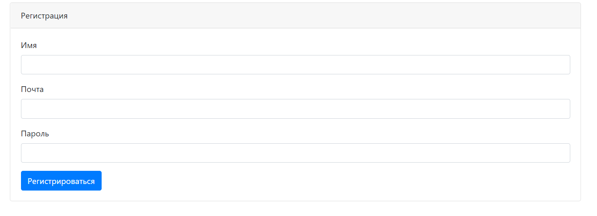

# job4j_dreamjob
## Проект "Работа мечты"

Цель данного проекта представить веб-приложение взаимодействия
кандидатов и менеджеров по персоналу.

<ul>
<li>Кандидаты  публикуют резюме.</li>
<li>Менеджеры по персоналу  публикуют вакансии о работе</li>
</ul>

<em>Проект реализован на JavaEE-технологии и web-программирование с помощью Servlet и JSP.</em>

При загрузке Url сайта, появляется следующие:

1. происходит аутентификация c помощью Servlet Filter

2. если нет доступа необходима регистрация

3. дальше происходит авторизация

* В данном проекте есть возможность  применять CRUD к пользователю и 
  кандидатам
* Подключение БД - PostgresSQL
* Реализован функционал добавления и скачивания файлов

* Тестирование функционала с помощью библиотеки JUnit,
* Динамически через Ajax загружать Json данные

